# Claude Code 多用户版 — 前端对接 API 文档

> Base URL: `http://{host}:{port}`
> 版本：v1
> 最后更新：2026-04-24
> 本文档基于后端源码（router.ts, wsHandler.ts, QueryEngine.ts, queryHelpers.ts, systemInit.ts）完整梳理

---

## 1. 通用约定

### 1.1 认证

服务器启动时可通过 `--auth-token` 或 `CLAUDE_SERVER_AUTH_TOKEN` 环境变量设置鉴权令牌。

```
Authorization: Bearer {token}
```

未配置 `authToken` 时，所有请求免鉴权。

### 1.2 Content-Type

所有请求/响应均使用 JSON：

```
Content-Type: application/json
```

SSE 端点除外（见第 5 节）。

### 1.3 错误响应格式

所有错误返回统一结构：

```json
{
  "error": "描述信息"
}
```

| HTTP 状态码 | 含义 |
|------------|------|
| 400 | 请求体无效 / 缺少必填字段 |
| 401 | 未认证（缺少或无效 Authorization 头） |
| 404 | 资源不存在（会话 ID 无效） |
| 429 | 超出速率限制 / 会话数上限 |
| 500 | 服务端内部错误 |

---

## 2. 服务端点

### 2.1 健康检查

```
GET /v1/health
```

**响应** `200`：

```json
{
  "status": "ok",
  "sessions": 3,
  "uptime": 123.456
}
```

| 字段 | 类型 | 说明 |
|------|------|------|
| `status` | `string` | 固定 `"ok"` |
| `sessions` | `number` | 当前活跃会话数 |
| `uptime` | `number` | 服务运行秒数 |

---

## 3. 会话管理

### 3.1 创建会话

```
POST /v1/sessions
```

**请求体**：

```json
{
  "apiKey": "sk-ant-xxx",
  "baseUrl": "https://api.anthropic.com",
  "provider": "firstParty",
  "model": "claude-sonnet-4-20250514",
  "userId": "alice",
  "cwd": "/path/to/project",
  "permissions": {
    "mode": "allow_all"
  },
  "mcpServers": {
    "my-server": {
      "command": "node",
      "args": ["mcp-server.js"],
      "env": { "KEY": "value" }
    }
  },
  "resumeFrom": "previous-session-id"
}
```

| 字段 | 类型 | 必填 | 说明 |
|------|------|------|------|
| `apiKey` | `string` | 否 | Anthropic API Key，不传则使用环境变量（`ANTHROPIC_AUTH_TOKEN` > `ANTHROPIC_API_KEY`） |
| `baseUrl` | `string` | 否 | API 基础 URL，默认 `process.env.ANTHROPIC_BASE_URL` |
| `provider` | `string` | 否 | API 提供商：`"firstParty"` / `"bedrock"` / `"vertex"` / `"foundry"` |
| `model` | `string` | 否 | 指定模型，如 `"claude-sonnet-4-20250514"` |
| `userId` | `string` | 否 | 用户标识，用于隔离和日志 |
| `cwd` | `string` | 否 | 工作目录，默认服务器的 workspace |
| `permissions` | `object` | 否 | 权限配置 |
| `permissions.mode` | `string` | 否 | `"allow_all"`（默认）/ `"default"` 等 |
| `mcpServers` | `object` | 否 | MCP 服务器配置，key 为服务器名 |
| `mcpServers.*.command` | `string` | 是 | MCP 服务器启动命令 |
| `mcpServers.*.args` | `string[]` | 否 | 命令参数 |
| `mcpServers.*.env` | `object` | 否 | 环境变量 |
| `resumeFrom` | `string` | 否 | 从历史会话 ID 恢复对话 |

**响应** `201`：

```json
{
  "id": "7c09fe29-ae22-4746-9d2f-229ce61134eb",
  "createdAt": 1776573461253,
  "cwd": "/path/to/project",
  "model": "claude-sonnet-4-20250514"
}
```

| 字段 | 类型 | 必出现 | 说明 |
|------|------|--------|------|
| `id` | `string (uuid)` | 是 | 会话唯一标识 |
| `createdAt` | `number (epoch ms)` | 是 | 创建时间戳 |
| `cwd` | `string` | 是 | 实际工作目录 |
| `model` | `string` | 否 | 仅在创建时指定了 model 时返回 |
| `resumedFrom` | `string` | 否 | 仅在指定了 `resumeFrom` 且恢复成功时返回 |
| `resumedMessageCount` | `number` | 否 | 仅在指定了 `resumeFrom` 时返回，恢复的历史消息数量 |

**错误**：
- `400`：`{"error":"Invalid JSON body"}`
- `404`：`{"error":"No conversation history found for session xxx"}` （resumeFrom 失败）
- `429`：`{"error":"Maximum sessions reached (100)"}`

---

### 3.2 列出会话

```
GET /v1/sessions
GET /v1/sessions?userId=alice
```

**查询参数**：

| 参数 | 类型 | 必填 | 说明 |
|------|------|------|------|
| `userId` | `string` | 否 | 按用户 ID 筛选，不传则返回全部会话 |

**响应** `200`：

```json
{
  "sessions": [
    {
      "id": "7c09fe29-ae22-4746-9d2f-229ce61134eb",
      "createdAt": 1776573461253,
      "lastActivityAt": 1776573461284,
      "cwd": "/path/to/project",
      "userId": "alice",
      "model": "claude-sonnet-4-20250514"
    }
  ]
}
```

| 字段 | 类型 | 必出现 | 说明 |
|------|------|--------|------|
| `id` | `string (uuid)` | 是 | 会话 ID |
| `createdAt` | `number (epoch ms)` | 是 | 创建时间戳 |
| `lastActivityAt` | `number (epoch ms)` | 是 | 最后活跃时间戳 |
| `cwd` | `string` | 是 | 工作目录 |
| `userId` | `string \| null` | 是 | 用户标识 |
| `model` | `string` | 否 | 仅在创建时指定了 model 时返回 |

---

### 3.3 获取单个会话

```
GET /v1/sessions/{sessionId}
```

**响应** `200`：

```json
{
  "id": "7c09fe29-ae22-4746-9d2f-229ce61134eb",
  "createdAt": 1776573461253,
  "lastActivityAt": 1776573461284,
  "cwd": "/path/to/project",
  "wsConnections": 1,
  "model": "claude-sonnet-4-20250514"
}
```

| 字段 | 类型 | 必出现 | 说明 |
|------|------|--------|------|
| `id` | `string (uuid)` | 是 | 会话 ID |
| `createdAt` | `number (epoch ms)` | 是 | 创建时间戳 |
| `lastActivityAt` | `number (epoch ms)` | 是 | 最后活跃时间戳 |
| `cwd` | `string` | 是 | 工作目录 |
| `wsConnections` | `number` | 是 | 当前 WebSocket 连接数 |
| `model` | `string` | 否 | 仅在创建时指定了 model 时返回 |

**错误** `404`：`{"error":"Session not found"}`

---

### 3.4 销毁会话

```
DELETE /v1/sessions/{sessionId}
```

**响应** `200`：

```json
{
  "destroyed": true
}
```

**错误** `404`：`{"error":"Session not found"}`

---

### 3.5 获取会话消息

```
GET /v1/sessions/{sessionId}/messages?userId=alice&cwd=/path/to/project
```

**查询参数**：

| 参数 | 类型 | 必填 | 说明 |
|------|------|------|------|
| `userId` | `string` | 条件必填 | 当会话已销毁时必填，用于从磁盘加载 |
| `cwd` | `string` | 否 | 项目目录，默认使用服务器当前目录 |

**响应** `200`：

```json
{
  "sessionId": "7c09fe29-...",
  "messages": [
    {
      "uuid": "msg-001",
      "type": "user",
      "message": { "role": "user", "content": "帮我写一个排序函数" },
      "timestamp": "2025-04-24T10:00:00Z",
      "parentUuid": null
    },
    {
      "uuid": "msg-002",
      "type": "assistant",
      "parentUuid": "msg-001",
      "message": {
        "role": "assistant",
        "content": [
          { "type": "text", "text": "这是一个冒泡排序函数..." }
        ]
      },
      "timestamp": "2025-04-24T10:00:05Z"
    }
  ]
}
```

> 活跃会话从内存读取，已销毁会话从磁盘 JSONL 加载。

---

### 3.6 历史会话列表

```
GET /v1/sessions/history?cwd=/path/to/project&userId=alice
```

**查询参数**：

| 参数 | 类型 | 必填 | 说明 |
|------|------|------|------|
| `cwd` | `string` | 否 | 按工作目录筛选，默认使用服务器当前目录 |
| `userId` | `string` | 否 | 按用户 ID 筛选 |

**响应** `200`：

```json
{
  "sessions": [
    {
      "sessionId": "uuid",
      "path": "/path/to/transcript.jsonl",
      "mtime": 1776573461253,
      "ctime": 1776573461000,
      "size": 4096
    }
  ]
}
```

| 字段 | 类型 | 说明 |
|------|------|------|
| `sessionId` | `string (uuid)` | 历史会话 ID |
| `path` | `string` | JSONL transcript 文件路径 |
| `mtime` | `number (epoch ms)` | 最后修改时间 |
| `ctime` | `number (epoch ms)` | 创建时间 |
| `size` | `number` | 文件大小（字节） |

---

## 4. 发送消息（SSE 流式）

```
POST /v1/sessions/{sessionId}/message
```

**请求头**：

```
Content-Type: application/json
Accept: text/event-stream
```

**请求体**：

```json
{
  "content": "帮我写一个排序算法"
}
```

| 字段 | 类型 | 必填 | 说明 |
|------|------|------|------|
| `content` | `string` | 是 | 用户消息内容（非空字符串） |

**错误**：
- `400`：`{"error":"\"content\" must be a non-empty string"}` 或 `{"error":"Invalid JSON body"}`
- `404`：`{"error":"Session not found"}`

成功时返回 SSE 流（见下一节）。

---

### 4.2 提交工具交互响应

当 LLM 调用 `AskUserQuestion` 等需要用户交互的工具时，后端会暂停等待前端提交答案。SSE 流中 `assistant` 事件的 `tool_use` block 已包含问题内容，前端渲染选择界面后，通过此端点提交用户答案。

```
POST /v1/sessions/{sessionId}/tool-response
Content-Type: application/json
```

**请求体**：

```json
{
  "toolUseId": "toolu_01ABC123",
  "approved": true,
  "answers": {
    "你想要哪种排序算法？": "快速排序"
  },
  "annotations": {
    "你想要哪种排序算法？": {
      "notes": "需要稳定排序"
    }
  }
}
```

| 字段 | 类型 | 必填 | 说明 |
|------|------|------|------|
| `toolUseId` | `string` | 是 | `tool_use` block 的 `id` 字段 |
| `approved` | `boolean` | 否 | 是否接受（默认 `true`）。`false` 表示用户拒绝 |
| `answers` | `Record<string, string>` | 否 | 问题文本 → 选中选项的 label |
| `annotations` | `Record<string, {preview?:string, notes?:string}>` | 否 | 可选附注 |

**响应** `200`：

```json
{ "accepted": true }
```

**错误**：
- `400`：`{"error":"\"toolUseId\" is required"}`
- `404`：`{"error":"No pending tool response found for this toolUseId (may have timed out)"}`

**超时**：30 秒内未响应，工具自动拒绝，LLM 继续对话。

**完整交互流程**：

```
1. SSE: assistant → content[] 含 { type: "tool_use", name: "AskUserQuestion", id: "toolu_xxx", input: { questions: [...] } }
2. 前端: 解析 questions，渲染选择界面
3. 用户: 选择答案
4. 前端: POST /v1/sessions/{id}/tool-response { toolUseId: "toolu_xxx", answers: {...} }
5. SSE 流恢复: user(tool_result) → assistant(继续对话) → result → done
```

---

## 5. SSE 事件类型

SSE 响应格式：

```
Content-Type: text/event-stream
Cache-Control: no-cache
```

每个事件：

```
event: {事件类型}
data: {JSON 数据}

```

### 5.1 事件流顺序

正常流程（有 QueryEngine）：

```
session_id → [system(init)] → [user(replay)]*
    → [assistant | user | system(compact_boundary) | system(api_retry) | stream_event | tool_use_summary | tool_progress]*
    → result(success) → done
```

异常流程：

```
session_id → [system(init)] → result(error_*) → done
```

致命错误：

```
session_id → error → done
```

Echo 模式（无 QueryEngine）：

```
session_id → assistant(echo) → done
```

### 5.2 各事件详细结构

#### `session_id`（首个事件）

```json
{
  "sessionId": "7c09fe29-ae22-4746-9d2f-229ce61134eb"
}
```

| 字段 | 类型 | 说明 |
|------|------|------|
| `sessionId` | `string (uuid)` | 路由用会话 ID |

---

#### `system`（初始化消息）

源码位置：`utils/messages/systemInit.ts`

```json
{
  "type": "system",
  "subtype": "init",
  "cwd": "/path/to/project",
  "session_id": "internal-session-id",
  "tools": ["Bash", "Read", "Edit", "Write", "Glob", "Grep", "WebFetch", "WebSearch", "..."],
  "mcp_servers": [
    { "name": "my-server", "status": "stdio" }
  ],
  "model": "claude-sonnet-4-20250514",
  "permissionMode": "allow_all",
  "slash_commands": ["commit", "review-pr", "..."],
  "apiKeySource": "environment_variable",
  "betas": ["interleaved-thinking-2025-05-14", "..."],
  "claude_code_version": "999.0.0-restored",
  "output_style": "default",
  "agents": ["main", "task", "..."],
  "skills": ["commit", "review-pr", "..."],
  "plugins": [
    { "name": "plugin-name", "path": "/path/to/plugin", "source": "user" }
  ],
  "uuid": "uuid-string",
  "fast_mode_state": "off",
  "sessionId": "7c09fe29-ae22-4746-9d2f-229ce61134eb"
}
```

| 字段 | 类型 | 说明 |
|------|------|------|
| `type` | `string` | 固定 `"system"` |
| `subtype` | `string` | 固定 `"init"` |
| `cwd` | `string` | 当前工作目录 |
| `session_id` | `string` | 内部会话 ID |
| `tools` | `string[]` | 可用工具名称列表 |
| `mcp_servers` | `{name:string, status:string}[]` | 已连接的 MCP 服务器 |
| `model` | `string` | 使用的模型名称 |
| `permissionMode` | `string` | 权限模式 |
| `slash_commands` | `string[]` | 可用斜杠命令 |
| `apiKeySource` | `string` | API Key 来源 |
| `betas` | `string[]` | 启用的 API beta 特性 |
| `claude_code_version` | `string` | 版本号 |
| `output_style` | `string` | 输出风格 |
| `agents` | `string[]` | 可用 agent 类型 |
| `skills` | `string[]` | 可用 skill 名称 |
| `plugins` | `{name:string, path:string, source:string}[]` | 已加载插件 |
| `uuid` | `string (uuid)` | 消息 UUID |
| `fast_mode_state` | `"off" \| "on" \| "cooldown"` | 快速模式状态 |

前端应使用此事件初始化 UI，显示模型名称、工具列表等信息。

---

#### `system`（压缩边界）

源码位置：`QueryEngine.ts` 约 935 行

当上下文压缩发生时发出：

```json
{
  "type": "system",
  "subtype": "compact_boundary",
  "session_id": "internal-session-id",
  "uuid": "uuid-string",
  "compact_metadata": {
    "preservedSegment": {
      "headUuid": "uuid",
      "tailUuid": "uuid"
    },
    "originalMessageCount": 42,
    "compactedMessageCount": 10
  },
  "sessionId": "7c09fe29-ae22-4746-9d2f-229ce61134eb"
}
```

| 字段 | 类型 | 说明 |
|------|------|------|
| `type` | `string` | 固定 `"system"` |
| `subtype` | `string` | 固定 `"compact_boundary"` |
| `session_id` | `string` | 内部会话 ID |
| `uuid` | `string (uuid)` | 消息 UUID |
| `compact_metadata` | `object` | 压缩元数据（可能为 null） |

前端收到此事件后，应清除之前的消息显示，从压缩后的上下文重新开始。

---

#### `system`（API 重试）

源码位置：`QueryEngine.ts` 约 945 行

当 API 请求遇到可重试错误时：

```json
{
  "type": "system",
  "subtype": "api_retry",
  "attempt": 1,
  "max_retries": 3,
  "retry_delay_ms": 1000,
  "error_status": 429,
  "error": "rate_limit_error",
  "session_id": "internal-session-id",
  "uuid": "uuid-string",
  "sessionId": "7c09fe29-ae22-4746-9d2f-229ce61134eb"
}
```

| 字段 | 类型 | 说明 |
|------|------|------|
| `type` | `string` | 固定 `"system"` |
| `subtype` | `string` | 固定 `"api_retry"` |
| `attempt` | `number` | 当前重试次数（从 1 开始） |
| `max_retries` | `number` | 最大重试次数 |
| `retry_delay_ms` | `number` | 重试延迟（毫秒） |
| `error_status` | `number \| null` | HTTP 状态码 |
| `error` | `string` | 错误分类（如 `"rate_limit_error"`、`"overloaded_error"`） |
| `session_id` | `string` | 内部会话 ID |
| `uuid` | `string (uuid)` | 消息 UUID |

前端应显示重试提示。

---

#### `assistant`（LLM 回复）

源码位置：`queryHelpers.ts` normalizeMessage 函数，约 102 行

可多次出现，每条对应一个 content block 或一组相关 block：

```json
{
  "type": "assistant",
  "message": {
    "id": "msg_xxx",
    "type": "message",
    "role": "assistant",
    "model": "claude-sonnet-4-20250514",
    "content": [
      {
        "type": "thinking",
        "thinking": "内部推理文本...",
        "signature": "base64-signature"
      },
      {
        "type": "text",
        "text": "这里是回复的正文内容"
      },
      {
        "type": "tool_use",
        "id": "toolu_xxx",
        "name": "Bash",
        "input": {
          "command": "ls -la"
        }
      },
      {
        "type": "redacted_thinking",
        "data": "base64-data"
      }
    ],
    "stop_reason": null,
    "stop_sequence": null,
    "usage": {
      "input_tokens": 100,
      "output_tokens": 50,
      "cache_creation_input_tokens": 0,
      "cache_read_input_tokens": 0
    }
  },
  "parent_tool_use_id": null,
  "session_id": "internal-session-id",
  "uuid": "msg-uuid",
  "error": null,
  "sessionId": "7c09fe29-ae22-4746-9d2f-229ce61134eb"
}
```

**`message.content[]` 各 block 类型**：

| `type` 值 | 说明 | 关键字段 |
|-----------|------|---------|
| `"text"` | Markdown 文本 | `text: string` |
| `"thinking"` | 思考过程（可展开） | `thinking: string`, `signature: string` |
| `"redacted_thinking"` | 脱敏思考内容 | `data: string`（不可读，仅显示占位） |
| `"tool_use"` | 工具调用 | `id: string`, `name: string`, `input: object` |

**顶层字段**：

| 字段 | 类型 | 说明 |
|------|------|------|
| `type` | `string` | 固定 `"assistant"` |
| `message` | `object` | Anthropic API message 对象 |
| `message.id` | `string` | API 消息 ID |
| `message.model` | `string` | 使用的模型 |
| `message.content` | `ContentBlock[]` | 内容块数组 |
| `message.stop_reason` | `string \| null` | 见下表 |
| `message.stop_sequence` | `string \| null` | 自定义停止序列 |
| `message.usage` | `object` | 本条消息的 token 用量 |
| `parent_tool_use_id` | `string \| null` | 父工具调用 ID（子 agent 时非 null） |
| `session_id` | `string` | 内部会话 ID |
| `uuid` | `string (uuid)` | 消息 UUID |
| `error` | `unknown \| null` | 错误信息 |

**`stop_reason` 值**：

| 值 | 含义 |
|----|------|
| `null` | 消息还在流式生成 |
| `"end_turn"` | 正常结束 |
| `"tool_use"` | 需要执行工具后继续 |
| `"max_tokens"` | 达到最大 token 限制 |

---

#### `user`（工具执行结果 / 历史回放）

源码位置：`queryHelpers.ts` 约 204 行

**工具执行结果**：

```json
{
  "type": "user",
  "message": {
    "role": "user",
    "content": [
      {
        "type": "tool_result",
        "tool_use_id": "toolu_xxx",
        "content": "命令执行输出结果...",
        "is_error": false
      }
    ]
  },
  "parent_tool_use_id": null,
  "session_id": "internal-session-id",
  "uuid": "msg-uuid",
  "timestamp": "2026-04-19T08:54:19.812Z",
  "isSynthetic": false,
  "tool_use_result": "输出内容",
  "sessionId": "7c09fe29-ae22-4746-9d2f-229ce61134eb"
}
```

**历史消息回放**（Session 初始化时重放历史用户消息）：

```json
{
  "type": "user",
  "message": {
    "role": "user",
    "content": "用户之前发送的消息"
  },
  "parent_tool_use_id": null,
  "session_id": "internal-session-id",
  "uuid": "msg-uuid",
  "timestamp": "2026-04-19T08:54:18.000Z",
  "isReplay": true,
  "sessionId": "7c09fe29-ae22-4746-9d2f-229ce61134eb"
}
```

| 字段 | 类型 | 说明 |
|------|------|------|
| `type` | `string` | 固定 `"user"` |
| `message` | `object` | 用户消息对象 |
| `message.role` | `string` | 固定 `"user"` |
| `message.content` | `string \| ContentBlock[]` | 用户文本或工具结果数组 |
| `parent_tool_use_id` | `string \| null` | 父工具调用 ID |
| `session_id` | `string` | 内部会话 ID |
| `uuid` | `string (uuid)` | 消息 UUID |
| `timestamp` | `string` | ISO 时间戳 |
| `isReplay` | `boolean` | 是否为历史回放（仅回放消息有） |
| `isSynthetic` | `boolean` | 是否为系统生成的合成消息 |
| `tool_use_result` | `unknown` | MCP 工具结果详情 |

---

#### `stream_event`（API 原始流事件）

源码位置：`QueryEngine.ts` 约 818 行

当 `includePartialMessages` 启用时，每个 API streaming event 都会透传：

```json
{
  "type": "stream_event",
  "event": {
    "type": "message_start",
    "message": { "id": "msg_xxx", "usage": {...} }
  },
  "session_id": "internal-session-id",
  "parent_tool_use_id": null,
  "uuid": "uuid-string",
  "sessionId": "7c09fe29-ae22-4746-9d2f-229ce61134eb"
}
```

**`event.type` 值**：

| 值 | 说明 |
|----|------|
| `"message_start"` | 新消息开始 |
| `"content_block_start"` | 新内容块开始 |
| `"content_block_delta"` | 内容块增量更新（流式文本） |
| `"content_block_stop"` | 内容块结束 |
| `"message_delta"` | 消息级增量（含 stop_reason、usage） |
| `"message_stop"` | 消息结束 |

> **注意**：当前 Server 模式默认不启用 `includePartialMessages`，前端通常不会收到此事件。

---

#### `tool_use_summary`（工具使用摘要）

源码位置：`QueryEngine.ts` 约 962 行

```json
{
  "type": "tool_use_summary",
  "summary": "Read 3 files, ran 1 command",
  "preceding_tool_use_ids": ["toolu_xxx", "toolu_yyy"],
  "session_id": "internal-session-id",
  "uuid": "uuid-string",
  "sessionId": "7c09fe29-ae22-4746-9d2f-229ce61134eb"
}
```

| 字段 | 类型 | 说明 |
|------|------|------|
| `type` | `string` | 固定 `"tool_use_summary"` |
| `summary` | `string` | 工具使用摘要文本 |
| `preceding_tool_use_ids` | `string[]` | 关联的工具调用 ID 列表 |
| `session_id` | `string` | 内部会话 ID |
| `uuid` | `string (uuid)` | 消息 UUID |

---

#### `tool_progress`（工具执行进度）

源码位置：`queryHelpers.ts` 约 189 行

Bash/PowerShell 长时间运行命令的进度更新（仅在 `CLAUDE_CODE_REMOTE` 模式下发出）：

```json
{
  "type": "tool_progress",
  "tool_use_id": "toolu_xxx",
  "tool_name": "Bash",
  "parent_tool_use_id": "toolu_parent",
  "elapsed_time_seconds": 30,
  "task_id": "task-123",
  "session_id": "internal-session-id",
  "uuid": "uuid-string",
  "sessionId": "7c09fe29-ae22-4746-9d2f-229ce61134eb"
}
```

> **注意**：此事件仅在有 `CLAUDE_CODE_REMOTE` 或 `CLAUDE_CODE_CONTAINER_ID` 环境变量时发出，且有 30 秒的节流间隔。MVP 阶段前端可能收不到此事件。

---

#### `result`（最终结果）

源码位置：`QueryEngine.ts`，共有 5 个 `subtype`

##### `result` — `success`

正常完成时：

```json
{
  "type": "result",
  "subtype": "success",
  "is_error": false,
  "duration_ms": 5397,
  "duration_api_ms": 4234,
  "num_turns": 3,
  "result": "这里是最终回复的文本",
  "stop_reason": "end_turn",
  "session_id": "internal-session-id",
  "total_cost_usd": 0.00125,
  "usage": {
    "input_tokens": 1717,
    "cache_creation_input_tokens": 0,
    "cache_read_input_tokens": 20352,
    "output_tokens": 105,
    "server_tool_use": {
      "web_search_requests": 0,
      "web_fetch_requests": 0
    }
  },
  "modelUsage": {
    "claude-sonnet-4-20250514": {
      "inputTokens": 22126,
      "outputTokens": 169,
      "cacheReadInputTokens": 20416,
      "cacheCreationInputTokens": 0,
      "costUSD": 0.00125,
      "contextWindow": 200000,
      "maxOutputTokens": 32000
    }
  },
  "permission_denials": [],
  "fast_mode_state": "off",
  "structured_output": null,
  "uuid": "result-uuid",
  "sessionId": "7c09fe29-ae22-4746-9d2f-229ce61134eb"
}
```

##### `result` — `error_max_turns`

超过最大轮次：

```json
{
  "type": "result",
  "subtype": "error_max_turns",
  "is_error": true,
  "duration_ms": 30000,
  "duration_api_ms": 25000,
  "num_turns": 50,
  "stop_reason": null,
  "session_id": "internal-session-id",
  "total_cost_usd": 0.05,
  "usage": {...},
  "modelUsage": {...},
  "permission_denials": [],
  "fast_mode_state": "off",
  "errors": ["Reached maximum number of turns (50)"],
  "uuid": "result-uuid",
  "sessionId": "7c09fe29-ae22-4746-9d2f-229ce61134eb"
}
```

##### `result` — `error_max_budget_usd`

超过预算：

```json
{
  "type": "result",
  "subtype": "error_max_budget_usd",
  "is_error": true,
  "duration_ms": 15000,
  "duration_api_ms": 12000,
  "num_turns": 5,
  "stop_reason": "end_turn",
  "session_id": "internal-session-id",
  "total_cost_usd": 1.0,
  "usage": {...},
  "modelUsage": {...},
  "permission_denials": [],
  "fast_mode_state": "off",
  "errors": ["Reached maximum budget ($1)"],
  "uuid": "result-uuid",
  "sessionId": "7c09fe29-ae22-4746-9d2f-229ce61134eb"
}
```

##### `result` — `error_max_structured_output_retries`

结构化输出重试次数耗尽：

```json
{
  "type": "result",
  "subtype": "error_max_structured_output_retries",
  "is_error": true,
  "duration_ms": 10000,
  "duration_api_ms": 8000,
  "num_turns": 3,
  "stop_reason": null,
  "session_id": "internal-session-id",
  "total_cost_usd": 0.02,
  "usage": {...},
  "modelUsage": {...},
  "permission_denials": [],
  "fast_mode_state": "off",
  "errors": ["Failed to provide valid structured output after 5 attempts"],
  "uuid": "result-uuid",
  "sessionId": "7c09fe29-ae22-4746-9d2f-229ce61134eb"
}
```

##### `result` — `error_during_execution`

执行过程中出错：

```json
{
  "type": "result",
  "subtype": "error_during_execution",
  "is_error": true,
  "duration_ms": 5000,
  "duration_api_ms": 4000,
  "num_turns": 2,
  "stop_reason": null,
  "session_id": "internal-session-id",
  "total_cost_usd": 0.01,
  "usage": {...},
  "modelUsage": {...},
  "permission_denials": [],
  "fast_mode_state": "off",
  "errors": [
    "[ede_diagnostic] result_type=assistant last_content_type=tool_use stop_reason=null",
    "具体错误信息..."
  ],
  "uuid": "result-uuid",
  "sessionId": "7c09fe29-ae22-4746-9d2f-229ce61134eb"
}
```

**`result` 通用字段说明**：

| 字段 | 类型 | 说明 |
|------|------|------|
| `type` | `string` | 固定 `"result"` |
| `subtype` | `string` | 结果子类型（见上表） |
| `is_error` | `boolean` | 是否为错误结果 |
| `duration_ms` | `number` | 总耗时（毫秒） |
| `duration_api_ms` | `number` | API 耗时（毫秒） |
| `num_turns` | `number` | 本轮对话轮次 |
| `result` | `string` | 最终回复文本（仅 `success` 子类型有） |
| `stop_reason` | `string \| null` | 停止原因 |
| `session_id` | `string` | 内部会话 ID |
| `total_cost_usd` | `number` | 本次请求总费用（美元） |
| `usage` | `Usage` | token 用量统计 |
| `modelUsage` | `Record<string, ModelUsage>` | 按模型分类的用量 |
| `permission_denials` | `unknown[]` | 权限拒绝记录 |
| `fast_mode_state` | `"off" \| "on" \| "cooldown"` | 快速模式状态 |
| `structured_output` | `unknown` | 结构化输出结果（仅 `success` 子类型有，需启用 jsonSchema） |
| `errors` | `string[]` | 错误信息列表（仅错误子类型有） |
| `uuid` | `string (uuid)` | 结果 UUID |

**`usage` 对象**：

| 字段 | 类型 | 说明 |
|------|------|------|
| `input_tokens` | `number` | 输入 token 数 |
| `cache_creation_input_tokens` | `number` | 缓存创建 token 数 |
| `cache_read_input_tokens` | `number` | 缓存读取 token 数 |
| `output_tokens` | `number` | 输出 token 数 |
| `server_tool_use` | `object` | 服务端工具使用统计 |
| `server_tool_use.web_search_requests` | `number` | Web 搜索请求数 |
| `server_tool_use.web_fetch_requests` | `number` | Web 获取请求数 |

**`modelUsage` 单项**：

| 字段 | 类型 | 说明 |
|------|------|------|
| `inputTokens` | `number` | 输入 token |
| `outputTokens` | `number` | 输出 token |
| `cacheReadInputTokens` | `number` | 缓存读取 token |
| `cacheCreationInputTokens` | `number` | 缓存创建 token |
| `costUSD` | `number` | 费用（美元） |
| `contextWindow` | `number` | 上下文窗口大小 |
| `maxOutputTokens` | `number` | 最大输出 token |

---

#### `error`（流中错误）

路由层捕获未处理异常时发出：

```json
{
  "type": "error",
  "message": "描述信息",
  "sessionId": "7c09fe29-ae22-4746-9d2f-229ce61134eb"
}
```

| 字段 | 类型 | 说明 |
|------|------|------|
| `type` | `string` | 固定 `"error"` |
| `message` | `string` | 错误描述 |
| `sessionId` | `string (uuid)` | 会话 ID |

---

#### `done`（流结束标记）

```json
{
  "sessionId": "7c09fe29-ae22-4746-9d2f-229ce61134eb"
}
```

前端收到此事件后关闭 SSE 连接。

---

## 6. WebSocket 协议

```
WS ws://{host}:{port}/v1/sessions/{sessionId}/ws?token={authToken}
```

> **注意**：WebSocket 路径和连接方式取决于服务端 index.ts 的 Bun.serve 配置。
> WS 消息格式与 SSE 事件格式完全相同（均为 JSON），但通过 WS 帧传输。

### 6.1 连接

连接成功后服务端立即发送：

```json
{
  "type": "connected",
  "sessionId": "7c09fe29-ae22-4746-9d2f-229ce61134eb"
}
```

### 6.2 客户端 → 服务端

#### 发送消息

```json
{
  "type": "user_message",
  "content": "帮我写个排序"
}
```

| 字段 | 类型 | 必填 | 说明 |
|------|------|------|------|
| `type` | `string` | 是 | 固定 `"user_message"` |
| `content` | `string` | 是 | 消息内容（非空字符串） |

#### 心跳

```json
{
  "type": "ping"
}
```

#### 中断当前生成

```json
{
  "type": "interrupt"
}
```

### 6.3 服务端 → 客户端

WS 服务端发送的消息与 SSE 事件结构完全相同——QueryEngine 的 `submitMessage()` yield 的每条消息通过 `sendWs(ws, { type: msg.type, ...msg, sessionId })` 发送。因此 WS 客户端会收到与 SSE 相同的所有事件类型。

此外还有 WS 特有的消息：

| `type` | 说明 | 结构 |
|--------|------|------|
| `connected` | 连接确认 | `{"type":"connected","sessionId":"..."}` |
| `pong` | 心跳响应 | `{"type":"pong"}` |
| `interrupted` | 中断确认 | `{"type":"interrupted"}` |
| `done` | 本轮对话结束 | `{"type":"done","sessionId":"..."}` |
| `error` | 错误 | `{"type":"error","message":"...","sessionId":"..."}` |

以及所有 QueryEngine 事件（与 SSE 5.2 节结构一致）：

| `type` | 说明 |
|--------|------|
| `system` | init / compact_boundary / api_retry |
| `assistant` | LLM 回复 |
| `user` | 工具执行结果 / 历史回放 |
| `result` | 最终结果（含 5 种 subtype） |
| `stream_event` | API 原始流事件 |
| `tool_use_summary` | 工具使用摘要 |
| `tool_progress` | 工具执行进度 |

---

## 7. 前端集成指南

### 7.1 SSE 消息渲染流程

```
1. POST /v1/sessions → 获得 sessionId
2. POST /v1/sessions/{id}/message → 建立 SSE 流
3. 依次接收事件：
   session_id           → 记录会话 ID
   system(subtype=init) → 显示模型、工具列表
   system(subtype=compact_boundary) → 上下文压缩，可选清除旧消息
   system(subtype=api_retry) → 显示重试提示
   assistant            → 流式渲染 Markdown / 思考过程 / 工具调用
   user                 → 显示工具执行结果
   tool_use_summary     → 显示工具摘要
   tool_progress        → 显示进度（可选）
   result               → 显示最终统计（费用、耗时、token）
   done                 → 关闭连接
```

### 7.2 多会话管理

```javascript
// 每个用户会话独立
const aliceSession = await createSession({ apiKey: 'sk-alice', userId: 'alice' })
const bobSession = await createSession({ apiKey: 'sk-bob', userId: 'bob' })

// 并行发消息
sendMessage(aliceSession.id, 'hello')
sendMessage(bobSession.id, 'hello')
```

### 7.3 状态推导

前端可根据事件流自行推导会话状态：

```
收到 system(init) 后           → 会话就绪
POST /message 后               → running
收到 result 后                 → idle
收到 error 后                  → idle（出错）
```

### 7.4 TypeScript 类型定义

以下类型可直接复制到前端项目中使用。

```typescript
// ============================================================
// 基础枚举 / 字面量联合类型
// ============================================================

/** 助手消息停止原因 */
type StopReason = 'end_turn' | 'tool_use' | 'max_tokens' | null

/** result 事件子类型 */
type ResultSubtype =
  | 'success'
  | 'error_max_turns'
  | 'error_max_budget_usd'
  | 'error_max_structured_output_retries'
  | 'error_during_execution'

/** 快速模式状态 */
type FastModeState = 'off' | 'on' | 'cooldown'

// ============================================================
// Content Block 类型
// ============================================================

interface TextBlock {
  type: 'text'
  text: string
}

interface ThinkingBlock {
  type: 'thinking'
  thinking: string
  signature: string
}

interface RedactedThinkingBlock {
  type: 'redacted_thinking'
  data: string
}

interface ToolUseBlock {
  type: 'tool_use'
  id: string
  name: string
  input: Record<string, unknown>
}

interface ToolResultBlock {
  type: 'tool_result'
  tool_use_id: string
  content: string
  is_error: boolean
}

type AssistantContentBlock =
  | TextBlock
  | ThinkingBlock
  | RedactedThinkingBlock
  | ToolUseBlock

// ============================================================
// Token 用量类型
// ============================================================

interface Usage {
  input_tokens: number
  output_tokens: number
  cache_creation_input_tokens: number
  cache_read_input_tokens: number
  server_tool_use?: {
    web_search_requests: number
    web_fetch_requests: number
  }
}

interface ModelUsage {
  inputTokens: number
  outputTokens: number
  cacheReadInputTokens: number
  cacheCreationInputTokens: number
  costUSD: number
  contextWindow: number
  maxOutputTokens: number
}

// ============================================================
// SSE / WS 事件类型
// ============================================================

// --- session_id ---
interface SessionIdEvent {
  sessionId: string
}

// --- system (init) ---
interface SystemInitEvent {
  type: 'system'
  subtype: 'init'
  cwd: string
  session_id: string
  tools: string[]
  mcp_servers: Array<{ name: string; status: string }>
  model: string
  permissionMode: string
  slash_commands: string[]
  apiKeySource: string
  betas: string[]
  claude_code_version: string
  output_style: string
  agents: string[]
  skills: string[]
  plugins: Array<{ name: string; path: string; source: string }>
  uuid: string
  fast_mode_state: FastModeState
  sessionId: string
}

// --- system (compact_boundary) ---
interface SystemCompactBoundaryEvent {
  type: 'system'
  subtype: 'compact_boundary'
  session_id: string
  uuid: string
  compact_metadata?: {
    preservedSegment?: { headUuid: string; tailUuid: string }
    originalMessageCount?: number
    compactedMessageCount?: number
  }
  sessionId: string
}

// --- system (api_retry) ---
interface SystemApiRetryEvent {
  type: 'system'
  subtype: 'api_retry'
  attempt: number
  max_retries: number
  retry_delay_ms: number
  error_status: number | null
  error: string
  session_id: string
  uuid: string
  sessionId: string
}

type SystemEvent =
  | SystemInitEvent
  | SystemCompactBoundaryEvent
  | SystemApiRetryEvent

// --- assistant ---
interface AssistantEvent {
  type: 'assistant'
  message: {
    id: string
    type: 'message'
    role: 'assistant'
    model: string
    content: AssistantContentBlock[]
    stop_reason: StopReason
    stop_sequence: string | null
    usage: Usage
  }
  parent_tool_use_id: string | null
  session_id: string
  uuid: string
  error: unknown
  sessionId: string
}

// --- user ---
interface UserEvent {
  type: 'user'
  message: {
    role: 'user'
    content: string | ToolResultBlock[]
  }
  parent_tool_use_id: string | null
  session_id: string
  uuid: string
  timestamp?: string
  isReplay?: boolean
  isSynthetic?: boolean
  tool_use_result?: unknown
  sessionId: string
}

// --- stream_event ---
interface StreamEvent {
  type: 'stream_event'
  event: {
    type: 'message_start' | 'content_block_start' | 'content_block_delta' | 'content_block_stop' | 'message_delta' | 'message_stop'
    [key: string]: unknown
  }
  session_id: string
  parent_tool_use_id: string | null
  uuid: string
  sessionId: string
}

// --- tool_use_summary ---
interface ToolUseSummaryEvent {
  type: 'tool_use_summary'
  summary: string
  preceding_tool_use_ids: string[]
  session_id: string
  uuid: string
  sessionId: string
}

// --- tool_progress ---
interface ToolProgressEvent {
  type: 'tool_progress'
  tool_use_id: string
  tool_name: string
  parent_tool_use_id: string
  elapsed_time_seconds: number
  task_id?: string
  session_id: string
  uuid: string
  sessionId: string
}

// --- result (通用) ---
interface ResultEvent {
  type: 'result'
  subtype: ResultSubtype
  is_error: boolean
  duration_ms: number
  duration_api_ms: number
  num_turns: number
  result?: string
  stop_reason: StopReason
  session_id: string
  total_cost_usd: number
  usage: Usage
  modelUsage: Record<string, ModelUsage>
  permission_denials: unknown[]
  fast_mode_state: FastModeState
  structured_output?: unknown
  errors?: string[]
  uuid: string
  sessionId: string
}

// --- error ---
interface ErrorEvent {
  type: 'error'
  message: string
  sessionId: string
}

// --- done ---
interface DoneEvent {
  sessionId: string
}

/**
 * 所有 SSE/WS 事件联合类型
 *
 * 路由方式：
 * switch (event) {
 *   case 'session_id':      data → SessionIdEvent
 *   case 'system':          data → SystemEvent (按 subtype 区分)
 *   case 'assistant':       data → AssistantEvent
 *   case 'user':            data → UserEvent
 *   case 'stream_event':    data → StreamEvent
 *   case 'tool_use_summary': data → ToolUseSummaryEvent
 *   case 'tool_progress':   data → ToolProgressEvent
 *   case 'result':          data → ResultEvent
 *   case 'error':           data → ErrorEvent
 *   case 'done':            data → DoneEvent
 * }
 */
type SSEEvent =
  | SessionIdEvent
  | SystemEvent
  | AssistantEvent
  | UserEvent
  | StreamEvent
  | ToolUseSummaryEvent
  | ToolProgressEvent
  | ResultEvent
  | ErrorEvent
  | DoneEvent

// ============================================================
// 会话管理 API 类型
// ============================================================

/** POST /v1/sessions 请求 */
interface CreateSessionRequest {
  apiKey?: string
  baseUrl?: string
  provider?: string
  model?: string
  userId?: string
  cwd?: string
  permissions?: { mode: string }
  mcpServers?: Record<string, {
    command: string
    args?: string[]
    env?: Record<string, string>
  }>
  resumeFrom?: string
}

/** POST /v1/sessions 201 响应 */
interface CreateSessionResponse {
  id: string
  createdAt: number
  cwd: string
  model?: string
  resumedFrom?: string
  resumedMessageCount?: number
}

/** 会话列表项 */
interface SessionListItem {
  id: string
  createdAt: number
  lastActivityAt: number
  cwd: string
  userId: string | null
  model?: string
}

/** GET /v1/sessions 200 响应 */
interface SessionListResponse {
  sessions: SessionListItem[]
}

/** GET /v1/sessions/:id 200 响应 */
interface SessionDetailResponse {
  id: string
  createdAt: number
  lastActivityAt: number
  cwd: string
  wsConnections: number
  model?: string
}

/** 历史会话条目 */
interface SessionHistoryEntry {
  sessionId: string
  path: string
  mtime: number
  ctime: number
  size: number
}

/** GET /v1/sessions/history 200 响应 */
interface SessionHistoryResponse {
  sessions: SessionHistoryEntry[]
}

// ============================================================
// WebSocket 消息类型
// ============================================================

/** 客户端 → 服务端 */
type WSClientMessage =
  | { type: 'user_message'; content: string }
  | { type: 'ping' }
  | { type: 'interrupt' }

/** 服务端 → 客户端（WS 特有 + 所有 SSE 事件类型） */
type WSServerMessage =
  | { type: 'connected'; sessionId: string }
  | { type: 'pong' }
  | { type: 'interrupted' }
  | { type: 'done'; sessionId: string }
  | { type: 'error'; message: string; sessionId?: string }
  | SystemEvent
  | AssistantEvent
  | UserEvent
  | StreamEvent
  | ToolUseSummaryEvent
  | ToolProgressEvent
  | ResultEvent
```

---

## 8. 环境变量 / 启动参数

| 参数 | 环境变量 | 默认值 | 说明 |
|------|---------|--------|------|
| `--port` | `CLAUDE_SERVER_PORT` | `8080` | 监听端口 |
| `--host` | `CLAUDE_SERVER_HOST` | `0.0.0.0` | 监听地址 |
| `--auth-token` | `CLAUDE_SERVER_AUTH_TOKEN` | 无 | 鉴权令牌 |
| `--max-sessions` | `CLAUDE_SERVER_MAX_SESSIONS` | `100` | 最大会话数 |
| `--idle-timeout` | `CLAUDE_SERVER_TIMEOUT_MS` | `1800000` | 空闲超时（ms） |
| `--workspace` | `CLAUDE_SERVER_WORKSPACE` | 当前目录 | 默认工作目录 |

---

## 9. 完整 SSE 事件类型速查表

| 事件名 | 发送时机 | 核心字段 |
|--------|---------|---------|
| `session_id` | 流开始 | `sessionId` |
| `system` (init) | 会话初始化 | `tools`, `model`, `cwd`, `fast_mode_state` |
| `system` (compact_boundary) | 上下文压缩 | `compact_metadata` |
| `system` (api_retry) | API 重试 | `attempt`, `max_retries`, `error` |
| `assistant` | LLM 回复 | `message.content[]` (text/thinking/tool_use) |
| `user` | 工具结果/历史回放 | `message.content`, `isReplay` |
| `stream_event` | API 原始流（可选） | `event.type` (message_start/delta/stop 等) |
| `tool_use_summary` | 工具摘要 | `summary`, `preceding_tool_use_ids` |
| `tool_progress` | 长命令进度 | `tool_name`, `elapsed_time_seconds` |
| `result` (success) | 正常完成 | `result`, `total_cost_usd`, `usage` |
| `result` (error_max_turns) | 超轮次 | `errors`, `num_turns` |
| `result` (error_max_budget_usd) | 超预算 | `errors`, `total_cost_usd` |
| `result` (error_max_structured_output_retries) | 结构化输出失败 | `errors` |
| `result` (error_during_execution) | 执行出错 | `errors`（含诊断信息） |
| `error` | 路由层未捕获异常 | `message` |
| `done` | 流结束 | `sessionId` |

---

## 10. 最小 MVP 对接指南

> 本节定义前端能用最短时间跑通的核心子集。只需实现以下内容即可获得一个可用的 AI 对话界面。

### 10.1 MVP 需要的 3 个 API

| # | 方法 | 路径 | 用途 |
|---|------|------|------|
| 1 | `POST` | `/v1/sessions` | 创建会话 |
| 2 | `POST` | `/v1/sessions/{id}/message` | 发消息（SSE 流式） |
| 3 | `DELETE` | `/v1/sessions/{id}` | 销毁会话（可选，页面关闭时调用） |

### 10.2 MVP 需要处理的 6 种事件

16 种 SSE 事件中，MVP 只需处理这 6 种：

| # | 事件 | 必须处理的内容 | 最少字段 |
|---|------|--------------|---------|
| 1 | `session_id` | 记录会话 ID | `sessionId` |
| 2 | `system` (`subtype=init`) | 可选：显示模型名 | `model` |
| 3 | `assistant` | 渲染 AI 回复 | `message.content[]` 中 `type=text` 的 `text` 字段 |
| 4 | `user` | 显示工具执行结果 | `message.content[]` 中 `type=tool_result` 的 `content` 字段 |
| 5 | `result` | 判断结束 + 显示费用 | `subtype`, `is_error`, `result`, `total_cost_usd` |
| 6 | `done` | 关闭连接 | `sessionId` |

其余 10 种事件（`compact_boundary`、`api_retry`、`stream_event`、`tool_use_summary`、`tool_progress`、4 种 error result subtype、`error`）在 MVP 中可以安全忽略。

### 10.3 MVP 前端最小实现

```typescript
// --- 1. 创建会话 ---
const res = await fetch('/v1/sessions', {
  method: 'POST',
  headers: { 'Content-Type': 'application/json' },
  body: JSON.stringify({
    apiKey: 'sk-ant-xxx',       // 或不传，使用服务端环境变量
    userId: 'user-123',         // 可选
  }),
})
const { id: sessionId } = await res.json()

// --- 2. 发消息（SSE） ---
function sendMessage(sessionId: string, text: string) {
  const es = new EventSource('/v1/sessions/' + sessionId + '/message', {
    // EventSource 不支持 POST，需用 fetch + ReadableStream 替代
  })

  // 实际应使用 fetch + SSE 解析：
  fetch(`/v1/sessions/${sessionId}/message`, {
    method: 'POST',
    headers: { 'Content-Type': 'application/json' },
    body: JSON.stringify({ content: text }),
  }).then(handleSSEResponse)
}

// --- 3. SSE 流解析（伪代码） ---
async function handleSSEResponse(response: Response) {
  const reader = response.body!.getReader()
  const decoder = new TextDecoder()
  let buffer = ''

  while (true) {
    const { done, value } = await reader.read()
    if (done) break
    buffer += decoder.decode(value, { stream: true })

    // 解析 SSE 格式: "event: xxx\ndata: {...}\n\n"
    const parts = buffer.split('\n\n')
    buffer = parts.pop()! // 保留未完成的部分

    for (const part of parts) {
      if (!part.trim()) continue
      const eventMatch = part.match(/^event: (.+)/m)
      const dataMatch = part.match(/^data: (.+)/m)
      if (!eventMatch || !dataMatch) continue

      const eventType = eventMatch[1]
      const data = JSON.parse(dataMatch[1])

      switch (eventType) {
        case 'session_id':
          console.log('会话已连接:', data.sessionId)
          break

        case 'assistant':
          // 核心：渲染 AI 回复
          for (const block of data.message.content) {
            if (block.type === 'text') {
              appendMessage('assistant', block.text)          // Markdown 渲染
            } else if (block.type === 'tool_use') {
              appendMessage('tool', `${block.name}: ${JSON.stringify(block.input)}`)
            } else if (block.type === 'thinking') {
              // MVP 可忽略，或折叠显示
            }
          }
          break

        case 'user':
          // 工具执行结果
          if (Array.isArray(data.message.content)) {
            for (const block of data.message.content) {
              if (block.type === 'tool_result') {
                appendMessage('result', block.content)
              }
            }
          }
          break

        case 'result':
          if (data.subtype === 'success') {
            // 最终文本 + 统计
            appendMessage('summary', data.result)
            showStats(data.total_cost_usd, data.duration_ms)
          } else {
            // 所有错误子类型统一处理
            showError(data.errors?.join('\n') ?? 'Unknown error')
          }
          break

        case 'error':
          showError(data.message)
          break

        case 'done':
          setLoading(false)  // 关闭 loading 状态
          break

        // 其余事件 MVP 不处理，安全忽略
        default:
          break
      }
    }
  }
}

// --- 4. 销毁会话（可选） ---
async function destroySession(sessionId: string) {
  await fetch(`/v1/sessions/${sessionId}`, { method: 'DELETE' })
}
```

### 10.4 MVP 状态管理

前端只需 3 个状态：

```
idle      → 显示输入框，等待用户输入
running   → 显示 loading，POST /message 后立即设置
idle      → 收到 result 或 done 后恢复
```

不需要 `state_change` 事件，前端自行推导即可。

### 10.5 MVP 不需要的功能

| 功能 | 原因 |
|------|------|
| `state_change` 事件 | 前端自行推导 running/idle |
| `progress` / `tool_progress` | 用 assistant 的 stop_reason 判断即可 |
| `stream_event` | Server 模式默认不开启 |
| `tool_use_summary` | 非核心，可后补 |
| `compact_boundary` | 长对话才触发，MVP 阶段忽略 |
| `api_retry` | 非核心，后端自动重试 |
| WebSocket | MVP 用 SSE 即可，WS 是增强功能 |
| 消息历史 API | MVP 不做页面刷新恢复 |
| 历史会话列表 | MVP 不需要 |
| `userId` 筛选 | 单用户场景不需要 |
| `resumeFrom` | MVP 不需要恢复会话 |
| `thinking` 渲染 | 折叠显示或直接忽略 |
| `redacted_thinking` | 不需要处理 |

### 10.6 MVP → 完整版升级路径

```
Phase 1 (MVP):   3 API + 6 事件 → 可用对话界面
Phase 2:         + WebSocket + interrupt + 路由守护
Phase 3:         + thinking 渲染 + tool_use_summary + compact_boundary 处理
Phase 4:         + 消息历史 + 会话恢复(resumeFrom) + 历史列表
Phase 5:         + progress 精度 + 状态推送 + 权限弹窗
```

---

## 11. 用户隔离机制

### 11.1 userId 传递位置

| 场景 | 传递方式 |
|------|----------|
| 创建会话 | `POST body: { userId: "alice" }` |
| 列出会话 | `GET /v1/sessions?userId=alice` |
| 历史列表 | `GET /v1/sessions/history?userId=alice&cwd=...` |
| 已销毁会话消息 | `GET /v1/sessions/:id/messages?userId=alice&cwd=...` |

### 11.2 存储路径隔离

```
无 userId:
  ~/.claude/projects/<sanitized-cwd>/<sessionId>.jsonl

有 userId:
  ~/.claude/users/<sanitized-userId>/projects/<sanitized-cwd>/<sessionId>.jsonl
```

路径中的特殊字符替换为 `-`，超长路径追加哈希后缀（djb2 哈希）。

### 11.3 隔离范围

每个用户/会话拥有完全独立的：
- **STATE** — 全局状态副本（独立 cwd、verbose、settings 等）
- **Anthropic API Client** — 独立 apiKey、baseUrl
- **QueryEngine** — 对话引擎（独立消息历史）
- **MCP 连接** — 外部工具服务器
- **WebSocket 连接集合**
- **AbortController** — 中断控制

不存在跨用户数据泄漏。所有模块级函数（`getState`, `getCwd` 等）通过 AsyncLocalStorage 路由到当前请求所属会话的状态。

---

## 12. 历史续接机制

### 12.1 续接流程

```mermaid
sequenceDiagram
    participant F as 前端
    participant B as 后端

    F->>B: GET /v1/sessions/history?userId=alice&cwd=...
    B-->>F: 返回历史会话列表

    F->>F: 用户选择历史会话 abc-123

    F->>B: GET /v1/sessions/abc-123/messages?userId=alice
    B-->>F: 返回历史消息（渲染到 UI）

    F->>B: POST /v1/sessions { userId: "alice", resumeFrom: "abc-123" }
    B->>B: 加载 abc-123.jsonl → 重建对话链 → 注入新 QueryEngine
    B-->>F: { id: "new-session-id", resumedFrom: "abc-123", resumedMessageCount: 12 }

    F->>B: POST /v1/sessions/new-session-id/message { content: "继续上次的话题" }
    B-->>F: SSE 流（LLM 带着完整历史上下文回复）
```



### 12.2 后端内部处理

1. 加载 `abc-123.jsonl` 转录文件
2. 找到叶子消息（最后一条），沿 `parentUuid` 向上回溯构建对话链
3. 创建新 QueryEngine，注入完整历史消息
4. 新消息时 LLM 收到完整上下文，从上次断点继续

---

## 13. AskUserQuestion 渲染指南

### 13.1 检测

在 `assistant` 事件的 `message.content` 中检测：

```typescript
const askBlocks = message.content.filter(
  block => block.type === 'tool_use' && block.name === 'AskUserQuestion'
)
```

### 13.2 数据结构

`tool_use` block 的 `input` 字段：

```typescript
interface AskUserQuestionInput {
  questions: Array<{
    question: string       // 问题文本，如 "你想要哪种排序算法？"
    header: string         // 短标签（≤12字符），如 "算法选择"
    options: Array<{
      label: string        // 选项显示文本（1-5词），如 "快速排序"
      description: string  // 选项说明
      preview?: string     // 可选，HTML 预览内容
    }>
    multiSelect: boolean   // 是否允许多选
  }>
}
```

- 1-4 个问题，每个 2-4 个选项
- 始终提供"其他"文本输入（前端自行实现）

### 13.3 渲染建议

```
┌─────────────────────────────────────┐
│  📋 算法选择                         │
│                                     │
│  你想要哪种排序算法？                 │
│                                     │
│  ┌──────────┐  ┌──────────┐        │
│  │ 快速排序  │  │ 归并排序  │        │
│  │ 平均O(nlogn) │ 稳定排序  │        │
│  └──────────┘  └──────────┘        │
│  ┌──────────┐  ┌──────────┐        │
│  │ 冒泡排序  │  │ 堆排序    │        │
│  │ 简单易懂  │  │ 原地排序  │        │
│  └──────────┘  └──────────┘        │
│                                     │
│  [其他: ________________]           │
│  [提交]                             │
└─────────────────────────────────────┘
```

### 13.4 回传答案

```typescript
// 用户点击"快速排序"
await fetch(`/v1/sessions/${sessionId}/tool-response`, {
  method: 'POST',
  headers: { 'Content-Type': 'application/json' },
  body: JSON.stringify({
    toolUseId: askBlock.id,          // tool_use block 的 id
    approved: true,
    answers: {
      '你想要哪种排序算法？': '快速排序'
    }
  })
})
```

### 13.5 拒绝回答

```typescript
await fetch(`/v1/sessions/${sessionId}/tool-response`, {
  method: 'POST',
  headers: { 'Content-Type': 'application/json' },
  body: JSON.stringify({
    toolUseId: askBlock.id,
    approved: false
  })
})
```
